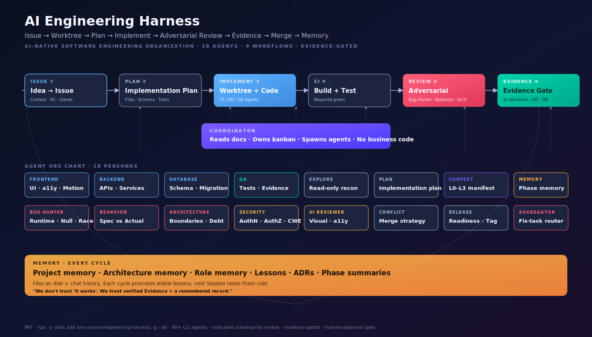

# AI Engineering Harness

> 一个由 AI Agent 组成的软件工程组织,负责把你脑子里到生产环境的每一行代码变成可验证、可审查、可追溯的工程交付。
>
> A software-engineering organization of AI agents that turns every idea into verifiable, reviewable, shippable code — Issue → Worktree → Plan → Implement → Adversarial Review → Evidence → Merge → Memory.

<p align="left">
  <a href="#-one-line-install"></a>
  <a href="./LICENSE"></a>
  <a href="https://github.com/lora-sys/ai-engineering-harness"></a>
</p>



*Coordinator reads docs, owns the kanban, and spawns 18 Agent personas across 9 closed-loop workflows. Every cycle is evidence-gated: code reaches `main` only when CI is green, ≥2 cold-start reviewers approve, and the Evidence pack is complete. Memory is promoted every cycle so the project gets smarter without losing it to chat history.*


**Social preview**:  [assets/social-preview.png](./assets/social-preview.png) (1200×630, for Twitter / GitHub social cards).

---

---

## 中文

### 这是什么

`ai-engineering-harness` 不是单条 Prompt,而是一整套**软件工程组织操作系统**。你给一个想法、一份 PRD,或者一个需要接手的老项目,Harness 会代你组建一个由 18 类 Agent 组成的工程团队:

| Agent 角色 | 职责 |
| --- | --- |
| Coordinator(协调员) | 读文档、维护 Project Status、分派任务,自己不写业务代码 |
| Explore / Plan | 探索代码库 / 编写可验收的实施计划 |
| Frontend / Backend / Database | 按 Issue + 计划在独立 Worktree 里实现 |
| QA | 跑测试、收集证据(截图、Playwright、API trace、DB 数据) |
| Bug Hunter / Behavior / Architecture Reviewer | **冷启动对抗式审查**,默认"实现一定有 Bug",只读 PR diff 和证据 |
| Security / UI Reviewer | 条件触发(权限/支付/隐私 → Security;UI → UI) |
| Conflict Resolver / Release / Review Aggregator | 冲突仲裁、发布前体检、审查汇总 |
| Context Assembly / Memory Curator | 按 L0–L3 控制上下文,沉淀阶段经验 |

每一次特性、每一次重构、每一次修复都走同一条闭环:

```
Idea → PRD → Issue → Agent 认领 → Worktree → 实施计划
     → 实现 → 自测 → Draft PR → CI → 对抗式审查 → 修 → 再审
     → 证据闸门 → 必要时人工审批 → 合并 → 阶段总结 → 记忆沉淀 → 下一轮
```

代码只有在 **CI Pass + 至少 2 名冷启动审查员 Approved + 证据完整 + 必要时人工批准** 时才进入 `main`。没有"看起来跑通了"这种状态——只有"可验证地跑通了"。

### 一行安装(全局生效到所有 CLI Agent)

```bash
npx -y skills add lora-sys/ai-engineering-harness -g --all
```

- `-g`:全局安装(写入用户级 skill 目录,而非当前项目)
- `--all`:把仓库里的所有 skill 安装到 **所有** 受支持的 CLI 编码 Agent

完成后,这套 Skill 会被放到 `~/.claude/skills/ai-engineering-harness/`、`~/.cursor/skills/ai-engineering-harness/`、`~/.gemini/skills/ai-engineering-harness/`、`~/.qwen/skills/ai-engineering-harness/`、`~/.grok/skills/ai-engineering-harness/`、`~/.codex/skills/ai-engineering-harness/`(默认直接 cp,可写就装)等 38 个 CLI Agent 的全局 Skill 目录。


> ⚠️ **`--all` 到底装什么**
>
> `npx skills add lora-sys/ai-engineering-harness -g --all` 会把**本仓库所有 Skill** 一次性装到 **所有受支持的 Agent** — 全局生效。
>
> 当前仓库里只有 **1 个 Skill**(`ai-engineering-harness`),所以 `--all` 等价于只装它,**安全**。
>
> 以后如果在这个仓库里加入姊妹 Skill,`--all` 会一并装,不再二次确认。这是 Vercel `skills` CLI 的设计意图(一行命令拿整套工具集),但也意味着:装第三方 fork 出来的多 skill 仓库时,**应该先预览再装**。下面三条命令用来限制范围:
>
> ```bash
> # 装之前先看看里面有什么
> npx -y skills add lora-sys/ai-engineering-harness --list
>
> # 只装这一个 skill
> npx -y skills add lora-sys/ai-engineering-harness -g -s ai-engineering-harness
>
> # 只装到指定 agent
> npx -y skills add lora-sys/ai-engineering-harness -g -a claude-code codex grok
>
> # 同时限定:一个 skill 一个 agent
> npx -y skills add lora-sys/ai-engineering-harness -g -s ai-engineering-harness -a claude-code
> ```
>
> 索引器使用的完整元数据见仓库根目录的 [`meta.json`](./meta.json)。

兼容性矩阵覆盖:Claude Code、Codex、Grok、Cursor、Gemini、Qwen、Cline、Hermes-Agent、Aider Desk、Amp、Antigravity、Continue、Cortex、Crush、Devin、Droid、Forgecode、Goose、Junie、Kilo、Kiro、Kode、Mar'sCode、Mistral Vibe、Mux、OpenCode、OpenHands、Pi、Qoder、Rovodev、Roo、Tabnine、Tinycloud、Trae、Warp、Windsurf、Zed、Zencoder、Zenflow、Neovate、Pochi、Adal 等 — `install.sh` 明确支持 40 个;`npx skills` CLI 生态系统涵盖 60+。

### 手动安装(若你想要更多控制)

```bash
# 克隆
git clone https://github.com/lora-sys/ai-engineering-harness.git
cd ai-engineering-harness

# 安装到所有 Agent(交互式选择目标)
./install.sh

# 安装到指定 Agent
./install.sh --target codex
./install.sh --target claude

# 一次性铺到所有可写目录
./install.sh --all

# 卸载
./install.sh --uninstall
```

`install.sh` 支持的 target(完整列表 38 个):
`codex` · `claude` · `agents` · `cursor` · `gemini` · `qwen` · `opencode` · `grok` · `hermes-agent` · `hermes` · `aider-desk` · `augment` · `bob` · `codebuddy` · `commandcode` · `continue` · `crush` · `devin` · `factory` · `forge` · `goose` · `iflow` · `junie` · `kilocode` · `kiro` · `kode` · `marscode` · `mux` · `neovate` · `openhands` · `pi` · `pochi` · `roo` · `snowflake` · `tabnine` · `trae` · `trae-cn` · `vibe` · `zencoder` · `adal`

### 典型用法

#### 1. 从 PRD 启动新项目

```
Use $ai-engineering-harness to bootstrap this repo from PRD.md.
```

`workflows/00-project-bootstrap.md` 会接管:在 repo 里创建 `docs/`、`memory/`、`PROJECT_STATUS.md`、Issue / PR 模板、CI 配置、ADR 模板、Phase 总结模板与首批 Issue。

#### 2. 接手老项目并补齐工程基础设施

```
Use $ai-engineering-harness. Read PROJECT_STATUS.md and continue the next Todo.
```

Harness 会先盘点代码、再决定是否需要 bootstrap,然后回到 Kanban 当前列。

#### 3. 把一个 Issue 推到 merged

```
Use $ai-engineering-harness to take Issue #17 from Planning to Done.
```

包括:写实施计划 → 分派到前端/后端/数据库 Agent → 拉分支与 Worktree → 实现 → 自测 → Draft PR → CI → 冷启动审查 → 修循环 → Evidence 闸门 → 合并 → 阶段总结 → 记忆沉淀。

#### 4. 复盘一个失序的工程

```
Use $ai-engineering-harness to audit this repo: list open PRs older than 7 days, flag missing Evidence, and produce a recovery plan.
```

### 工作机制

#### Issue 必须齐全以下字段

Context / Goal / Scope / Non-Goal / Related Docs / Implementation Plan / Acceptance Criteria / Evidence Requirements / Reviewer Requirements / Owner / Estimate。Coordinator 不会在缺失字段的 Issue 上启动代码。

#### 上下文按 L0–L3 分层加载

- **L0 全局规则**(`AGENTS.md`、`ENGINEERING.md`、`CONTRIBUTING.md` 摘要)— 始终加载
- **L1 任务级**——当前 Issue、模块架构、相邻 ADR、验证标准
- **L2 按需**——相邻模块、最近阶段总结、接口契约
- **L3 深层**——只有在显式需要时才加载;PDF/图片/长报告必须先抽取结论

`agents/context-assembly.md` 会为每个 Agent 任务产出 `context-manifest.md`,审查员能审计"这个 Agent 看到了什么"。

#### 证据闸门

Done 不是"PR 合进去了",而是 `docs/evidence/<id>/` 里齐了:

- `change-summary.md` + `verification.md`(每条 AC 的 PASS/FAIL)
- 前端:`screenshots/`(桌面/平板/手机/空/错/加载六态)+ Playwright trace + Console 干净 + a11y 扫描
- 后端:API trace、异常覆盖、鉴权负面用例、性能基线
- 数据库:migration + rollback、Pre/Post stats、Sample rows
- 审查:`review-<role>.md` × ≥ 2 + `fix-tasks.md` Aggregator ✅
- CI:绿;无 Critical/High 阻断

#### 人工审批闸门

涉及 鉴权/授权模型 / 数据库 schema(含数据迁移) / 生产密钥或付费 API / 发布版本 时,Coordinator 会主动 `request_user_input` 或停在 PROJECT_STATUS 上等待 `Waiting for Approval`。

#### 文件系统消息总线

每个 Session 在 `sessions/<id>/` 下维护 `status.md`、`plan.md`、`execution.md`、`review.md`、`summary.md`。Agent 之间不靠聊天历史,只靠这些文件 + 各 Issue 的 Evidence 目录。新 Session 启动时 Coordinator 读取 `memory/` + 上一次 `summary.md` 恢复未完成工作。

### 何时不要用这个 Skill

- 单文件一次性修改
- 不会落到仓库的原型
- 你想自己写代码、不想 Agent 介入

### 仓库结构

```
.
├── SKILL.md                    # Agent 加载入口
├── README.md                   # 你看到的这份
├── LICENSE
├── .gitignore
├── install.sh                  # 全局安装脚本(支持 38 个 CLI Agent)
├── agents/                     # 18 类 Agent 角色定义
├── workflows/                  # 9 个工作流
├── templates/                  # 16 套模板(Issue / Plan / PR / Review / Evidence / Phase / ADR 等)
├── checklists/                 # 6 份验收清单
├── references/                 # 6 份深化文档(L0–L3、索引、Worktree、Agent spawn)
├── examples/                   # 6 份已填写示例
└── scripts/                    # new-session / new-evidence / new-worktree / refresh-index / changelog
```

### 许可

MIT — 见 [LICENSE](./LICENSE)。

---

## English

### What this is

`ai-engineering-harness` is **a software-engineering organization**, not a coding prompt. Hand it an idea, a PRD, or a messy legacy repo — it spins up a 18-role AI engineering org that delivers every change through a verifiable, adversarial, evidence-gated loop.

The agent roster:

| Role | Purpose |
| --- | --- |
| **Coordinator** | Reads docs, owns the kanban, dispatches tasks — never writes feature code |
| **Explore / Plan** | Read-only recon of the codebase / synthesize an Implementation Plan |
| **Frontend / Backend / Database** | Implement on isolated Worktrees within their allow-lists |
| **QA** | Run tests, capture screenshots / Playwright / API / DB evidence |
| **Bug Hunter / Behavior Reviewer / Architecture Reviewer** | Cold-start adversarial reviewers — assume the implementation *has a bug*, only read the diff + evidence |
| **Security Reviewer / UI Reviewer** | Conditional (auth/payments/PII/secrets → Security; UI change → UI) |
| **Conflict Resolver / Release / Review Aggregator** | Merge disagreements, pre-release checks, fix-task dispatch |
| **Context Assembly / Memory Curator** | L0–L3 context control, phase-graded memory |

Every change goes through the same closed loop:

```
Idea → PRD → Issue → Agent claims → Worktree → Plan → Implement
     → Self-test → Draft PR → CI → Adversarial Review → Fix → Re-review
     → Evidence Gate → Human Approval (when needed) → Merge
     → Phase summary → Memory update → next Issue
```

Code only reaches `main` when **CI is green**, **≥2 cold-start reviewers approve**, **Evidence is complete**, and **human approval is on file when required**. There is no "it kinda works". There is only **verified** working.

### One-line install — every CLI agent, globally

```bash
npx -y skills add lora-sys/ai-engineering-harness -g --all
```

- `-g` → user-level / global install (instead of project-level)
- `--all` → install every skill in the repo into every supported CLI agent


> ⚠️ **What `--all` actually does**
>
> `npx skills add lora-sys/ai-engineering-harness -g --all` installs **every skill in this repo** into **every supported agent** — globally.
>
> Today, the repo contains **one skill** (`ai-engineering-harness`), so `--all` is equivalent to installing that one skill. Safe.
>
> If a sister skill is added to the repo later, `--all` will install it too — without an extra prompt. That's the design intent (one command gets the whole toolkit), but it does mean **you should preview before installing sister repos** you don't fully trust. Use these to limit scope:
>
> ```bash
> # Preview what's inside before installing
> npx -y skills add lora-sys/ai-engineering-harness --list
>
> # Limit to one skill
> npx -y skills add lora-sys/ai-engineering-harness -g -s ai-engineering-harness
>
> # Limit to specific agents
> npx -y skills add lora-sys/ai-engineering-harness -g -a claude-code codex grok
>
> # Both: one skill, one agent
> npx -y skills add lora-sys/ai-engineering-harness -g -s ai-engineering-harness -a claude-code
> ```
>
> For full metadata about this skill (used by indexes), see [`meta.json`](./meta.json) at the repo root.


After this runs, the skill lands in the global skill directory of every supported CLI agent:

- `~/.claude/skills/ai-engineering-harness/`
- `~/.cursor/skills/ai-engineering-harness/`
- `~/.gemini/skills/ai-engineering-harness/`
- `~/.qwen/skills/ai-engineering-harness/`
- `~/.grok/skills/ai-engineering-harness/`
- `~/.opencode/skills/ai-engineering-harness/` (in `~/.config/opencode/skills/`)
- and 30+ more — see the full compatibility matrix below.

**Supported agents**: Claude Code · Codex · Grok · Cursor · Gemini · Qwen · Cline · Hermes-Agent · Aider Desk · Amp · Antigravity · Continue · Cortex · Crush · Devin · Droid · Forgecode · Goose · Junie · Kilo · Kiro · Kode · Marscode · Mistral Vibe · Mux · OpenCode · OpenHands · Pi · Qoder · Rovodev · Roo · Tabnine · Tinycloud · Trae · Trae-CN · Warp · Windsurf · Zed · Zencoder · Zenflow · Neovate · Pochi · Adal · Bob · Codebuddy · Commandcode · KiloCode · Lingma · Loaf · Moxby · Vibe (40 explicitly listed in `install.sh`; 60+ covered by the npx skills CLI ecosystem; see install.sh --list for the exact set).

### Manual install — more control

```bash
# Clone
git clone https://github.com/lora-sys/ai-engineering-harness.git
cd ai-engineering-harness

# Interactive
./install.sh

# Specific target
./install.sh --target codex
./install.sh --target claude
./install.sh --target cursor

# Every writable location
./install.sh --all

# Uninstall
./install.sh --uninstall
```

`install.sh` targets (full list):

`codex`, `claude`, `agents`, `cursor`, `gemini`, `qwen`, `opencode`, `grok`, `hermes-agent`, `hermes`, `aider-desk`, `augment`, `bob`, `codebuddy`, `commandcode`, `continue`, `crush`, `devin`, `factory`, `forge`, `goose`, `iflow`, `junie`, `kilocode`, `kiro`, `kode`, `marscode`, `mux`, `neovate`, `openhands`, `pi`, `pochi`, `roo`, `snowflake`, `tabnine`, `trae`, `trae-cn`, `vibe`, `zencoder`, `adal`.

### Typical usage

#### 1. Start a brand-new project from a PRD

```
Use $ai-engineering-harness to bootstrap this repo from PRD.md.
```

The bootstrap workflow (`workflows/00-project-bootstrap.md`) will create `docs/`, `memory/`, `PROJECT_STATUS.md`, Issue / PR templates, CI configs, ADR / phase-summary templates, and a seed set of Issues.

#### 2. Resume or audit an existing project

```
Use $ai-engineering-harness. Read PROJECT_STATUS.md and continue the next Todo.
```

```
Use $ai-engineering-harness to audit this repo: list open PRs older than 7 days,
flag missing Evidence, and produce a recovery plan.
```

#### 3. Take one Issue to merged

```
Use $ai-engineering-harness to take Issue #17 from Planning to Done.
```

That walks: write Plan → spawn Frontend/Backend/Database on Worktrees → implement → self-test → Draft PR → CI → adversarial review → fix loop → Evidence Gate → merge → phase summary → memory write.

### How it works

#### Required Issue fields

Context / Goal / Scope / Non-Goal / Related Docs / Implementation Plan / Acceptance Criteria / Evidence Requirements / Reviewer Requirements / Owner / Estimate. The Coordinator refuses to start coding on an Issue missing any field.

#### L0–L3 context control

- **L0** — always-on rules (sketch of `AGENTS.md`, `ENGINEERING.md`, `CONTRIBUTING.md`)
- **L1** — task-local (Issue body, relevant module doc, ADR, ACs)
- **L2** — adjacent modules, recent phase summaries, interface contracts
- **L3** — deep context (only on explicit request); PDFs / images / long reports must be summarized, not loaded whole

`agents/context-assembly.md` produces a `context-manifest.md` for every task, so reviewers can audit what each Agent saw.

#### Evidence Gate

"Done" means `docs/evidence/<id>/` contains:

- `change-summary.md`, `verification.md` (PASS/FAIL per AC)
- Frontend: 6-state screenshots (desktop/tablet/mobile/empty/error/loading) + Playwright trace + console clean + a11y scan
- Backend: API trace, exception coverage, auth negative cases, perf baseline
- Database: migration + rollback, pre/post stats, sample rows
- Reviewers: `review-<role>.md` × ≥ 2 + `fix-tasks.md` Aggregator ✅
- CI: green, no Critical/High blocker

#### Human Approval Gate

Triggered for: auth/authz model · DB schema with data migration · production secrets or paid APIs · release/version. The Coordinator posts a `Waiting for Approval` note on `PROJECT_STATUS.md` and pauses.

#### File-system message bus

Each Session has `sessions/<id>/{status,plan,execution,review,summary}.md`. Agents coordinate through files, not chat. New Sessions read `memory/` + the last `summary.md` to resume.

### When NOT to use this skill

- One-file throwaway edits
- Prototypes you don't intend to keep
- You want to write the code yourself

### Repository layout

```
.
├── SKILL.md                 # entry point loaded by every Agent
├── README.md                # this file
├── LICENSE
├── .gitignore
├── install.sh               # multi-agent installer (38 targets)
├── agents/                  # 18 agent personas
├── workflows/               # 9 closed-loop procedures
├── templates/               # 16 templates (Issue / Plan / PR / Review / Evidence / Phase / ADR ...)
├── checklists/              # 6 acceptance checklists
├── references/              # 6 deep-dive docs (L0–L3, indexing, worktree, spawning)
├── examples/                # 6 filled samples
└── scripts/                 # session / evidence / worktree / index / changelog helpers
```

### License

MIT — see [LICENSE](./LICENSE).

---


## 使用指南 · Usage Guide

> 这一节把"装上后怎么用"讲透。先看 4 个最高频的指令,再看心法,最后看进阶与反模式。
>
> This section makes "how to actually use it" concrete. Read the 4 high-frequency invocations first, then principles, then advanced usage and anti-patterns.

### 4 个最高频指令 · Top 4 invocations

#### ① 从 PRD 启动新项目 · Bootstrap a new project from a PRD

```
Use $ai-engineering-harness to bootstrap this repo from PRD.md.
```

Coordinator 会按 `workflows/00-project-bootstrap.md` 一次创建 `docs/{product,architecture,design,decisions}`、`memory/`、`PROJECT_STATUS.md`、`AGENTS.md` / `CLAUDE.md`、`DESIGN.md`、`ENGINEERING.md`、`TESTING.md`、`CONTRIBUTING.md`、`.github/ISSUE_TEMPLATE/`、`.github/PULL_REQUEST_TEMPLATE.md`、Phase 总结模板与首批 Issue。

The Coordinator runs `workflows/00-project-bootstrap.md`, creating the full doc tree, memory, status, project meta-docs, GitHub Issue / PR templates, and the first round of Issues.

#### ② 接续已存在的工作 · Resume interrupted work

```
Use $ai-engineering-harness. Read PROJECT_STATUS.md and continue the next Todo.
```

它会读 `memory/` + 上一次 Session 的 `summary.md`,从中断处继续。

Reads `memory/` + the last Session's `summary.md` and picks up where you left off.

#### ③ 把单个 Issue 推到合并 · Take one Issue to merged

```
Use $ai-engineering-harness to take Issue #17 from Planning to Done.
```

走完整闭环:写 Plan → 在 Worktree 里分派 Frontend/Backend/Database Agent → 实现 → 自测 → Draft PR → CI → 冷启动对抗式审查(Bug Hunter + Behavior Reviewer + 必要时 Architecture/Security/UI Reviewer)→ 修循环 → Evidence Gate → 合入 → 阶段总结 → 记忆沉淀。

Walks the full closed loop: Plan → spawn Frontend/Backend/Database on isolated Worktrees → Implement → Self-test → Draft PR → CI → cold-start adversarial review (Bug Hunter + Behavior Reviewer, plus Architecture/Security/UI when warranted) → Fix loop → Evidence Gate → Merge → Phase summary → Memory write.

#### ④ 复盘 / 救火 · Audit or rescue

```
Use $ai-engineering-harness to audit this repo: list open PRs older than 7 days,
flag missing Evidence, and produce a recovery plan.
```

它盘点"现状 → 期望"的 Gap,转成一批自动归列的 Issue,并给出先做的 3 件事与执行顺序。

The Coordinator inventories the gap from "current" to "expected", files a batch of Issues on the kanban, and surfaces the first three actions with sequencing.

### 使用心法 · Operating principles

| # | 原则 · Principle | 为什么 · Why |
|---|---|---|
| 1 | **信任证据,不信任"看起来好了" · Trust evidence, not vibes** | Coordinator 不会因为"本地测试过了"就合并。它要看到 `docs/evidence/<id>/` 里所有 `verification.md` 的 AC 行 PASS,且 CI 绿、≥ 2 名审查员 ✅、Aggregator ✅。Missing one → not Done. |
| 2 | **冷启动审查 · Cold-start reviews** | Reviewer 只读 Issue + Plan + PR diff + Evidence,**不读实现者的聊天或解释**。这避免了"自己说服自己"。 |
| 3 | **Issue 是工作单元 · Issues are the unit of work** | 没有 Issue 不开工。Issue 必须有 Context / Goal / Scope / Non-Goal / Related Docs / Plan / AC / Evidence Reqs / Reviewer Reqs / Owner / Estimate。 |
| 4 | **Worktree 隔离 · Worktree isolation** | 一个 Issue = 一个 Owner = 一个 Worktree = 一个分支。多个并行 Owner 互不干扰,只在冲突时进 Conflict Resolver。 |
| 5 | **上下文按 L0–L3 加载 · L0–L3 context control** | 默认不加载 `docs/` 全文。让 `agents/context-assembly.md` 按任务产出 `context-manifest.md`,只给 Agent 当前必需的最小可信上下文。 |
| 6 | **人工审批闸门 · Human Approval Gate** | 涉及 鉴权 / 数据库 schema / 生产密钥 / 付费 API / 发布版本 时,Coordinator 会主动 `request_user_input` 并暂停。它不会代你做这些判断。 |
| 7 | **记忆是项目状态,不是聊天 · Memory is project state, not chat** | 稳定结论写到 `docs/` 与 `memory/`;对话历史不留。每个 Phase 结束后 Coordinator 跑 `workflows/06-phase-summary.md` 沉淀。 |

### 典型指令清单 · Canonical invocations

```text
# 启动
Use $ai-engineering-harness to bootstrap this repo from PRD.md.

# 接续
Use $ai-engineering-harness. Read PROJECT_STATUS.md and continue the next Todo.

# 单 Issue 推动
Use $ai-engineering-harness to take Issue #17 from Planning to Done.

# 复盘 / 救火
Use $ai-engineering-harness to audit this repo and produce a recovery plan.

# 跨 CLI 接力(从 Claude 切到 Grok,聊天历史没用,落盘状态才行)
Use $ai-engineering-harness. I'm continuing from another agent. Read
memory/project-memory.md and sessions/<last-id>/summary.md, then continue.

# 只取一个 Phase 总结,而不打开所有 docs/
Use $ai-engineering-harness. Summarize the latest phase.

# 把多个 Issue 并行分派给前端 / 后端 / 数据库 Agent
Use $ai-engineering-harness to spawn parallel Owners for Issue #20, #21, #22.
```

### 进阶用法 · Advanced usage

#### 30 秒拉起一个新项目

```bash
mkdir my-saas && cd my-saas
git init
echo "# My SaaS" > README.md
git add . && git commit -m "feat: init"

# 进入任意 CLI(Codex / Claude / Grok / Cursor / Gemini ...)
# Use $ai-engineering-harness to bootstrap this repo from PRD.md
```

Coordinator 会生成目录骨架、首轮 Issue、ADR 模板、CI 工作流占位,然后在 `PROJECT_STATUS.md` 上写 "Phase 0 / Bootstrap — Done"。

#### 接手老项目,补齐工程基础设施

```
Use $ai-engineering-harness to take over this repo. Inventory the gap
between current state and harness layout; file Issues for the missing
pieces; do not edit code yet.
```

它先盘点 → 把差距落 Issue,再按 Issue 推进;**不会先去动业务代码**。

#### 跨 CLI 接力

Harness 的所有状态都落盘,**聊天历史不会丢**。从 Claude 切到 Grok 时:

```
Use $ai-engineering-harness. I'm continuing from another agent. Read
memory/project-memory.md and the latest sessions/<id>/summary.md.
```

#### 让 Agent 并行做多件事

```
Use $ai-engineering-harness to plan and dispatch Issue #18 (frontend),
#19 (backend), #20 (database) in parallel Worktrees.
```

Coordinator 会分别拉 `feature/18-...`、`feature/19-...`、`feature/20-...` 三个 Worktree,每个 Owner 独立推到 PR。冲突时由 Conflict Resolver 处理,**不会自动覆盖**。

#### 在 CI 出错时让它自愈

```
CI is red on PR #N. Use $ai-engineering-harness to recover.
```

走 `workflows/04-ci-recovery.md`:60 秒分类(flaky / 真缺陷 / lint / 集成 / infra)→ 派 Owner Agent 修复 → 重新跑 CI → 重新走 Reviewer。

### 不要这样用 · Anti-patterns

| 反模式 · Anti-pattern | 为什么不行 · Why it fails | 应该做 · Do this instead |
|---|---|---|
| 缺字段的 Issue 上让它"先做着" | Coordinator 不会启动。 | 补齐字段(模板就在 `.github/ISSUE_TEMPLATE/`)。 |
| 直接改 `main` / `master` | 拒绝。Worktree 是硬要求。 | `git worktree add ../proj-issue-<id> -b feature/<id>-<slug> main` |
| 让实现者同时"自审" | 审查员**必须冷启动**。 | 让它 spawn 一个独立 Reviewer Agent,只喂 Issue + Diff + Evidence。 |
| 把 100 页 PDF 当成整个 Spec 直接喂 | 上下文会被垃圾塞满。 | 用 `agents/context-assembly.md` 抽出相关章节再喂。 |
| "我觉得可以合并" | 不会合并。要 Evidence Gate 全绿 + Aggregator ✅。 | 等 Coordinator 自己报 Ready。 |
| 在它做事的中间打断催 | 打断 = 状态不一致。 | 看 PROJECT_STATUS.md / TaskList,不要直接抢方向盘。 |
| 把它当一次性 coding prompt | 它不是 Prompt,是 Harness。 | 用它管产品,不是写一行代码。 |

### 适用 / 不适用 速查 · When (not) to use

| 场景 · Scenario | 用 Harness? · Use it? |
|---|:---:|
| 把一个 PRD 落地成 MVP | ✅ 必须 · Mandatory |
| 多 Issue 并行开发 | ✅ 必须 · Mandatory |
| 接手老项目、清理技术债 | ✅ 强烈推荐 · Strongly recommended |
| 复盘一个失序的 repo | ✅ 强烈推荐 · Strongly recommended |
| 跨团队 / 跨 CLI 协作 | ✅ 推荐 · Recommended |
| 改一行 typo / 文案 / 配置 | ❌ 不要 · Skip |
| 一次性脚本 / 一次性原型 | ❌ 不要 · Skip |
| 只是想聊架构想法 / 解释概念 | ❌ 不要 · Skip |

### 维护 · Maintenance

```bash
# 升级到最新版本
npx -y skills update lora-sys/ai-engineering-harness -g

# 查看当前装的版本
npx skills list -g

# 在项目仓库里加 git commit hook,自动维护 docs/ 的索引
cat > .githooks/post-commit <<'HOOK'
#!/usr/bin/env bash
bash <(curl -fsSL https://raw.githubusercontent.com/lora-sys/ai-engineering-harness/main/scripts/refresh-index.sh)
HOOK
chmod +x .githooks/post-commit
git config core.hooksPath .githooks
```

每个 Phase 完成后,Coordinator 会自动跑 `workflows/06-phase-summary.md` + `workflows/08-memory-evolution.md`,把"什么是真的学到的"沉淀进 `memory/<role>-memory.md`。下次有新 Session 启动,新 Agent 会先读这些再开工。

After each Phase, the Coordinator automatically runs `workflows/06-phase-summary.md` and `workflows/08-memory-evolution.md`, promoting stable lessons into `memory/<role>-memory.md`. Next Session, new Agents read these before starting work.

### 进阶阅读 · Further reading

- [`SKILL.md`](./SKILL.md) — Agent 加载的入口全文 · Entry document loaded by every agent
- [`agents/`](./agents/) — 18 类 Agent 角色 · 18 agent personas
- [`workflows/`](./workflows/) — 9 个工作流 · 9 closed-loop workflows
- [`templates/`](./templates/) — 16 套模板 · 16 templates (Issue / Plan / PR / Review / Evidence / Phase / ADR / ...)
- [`checklists/`](./checklists/) — 6 份验收清单 · 6 acceptance checklists
- [`examples/`](./examples/) — 6 份已填写示例 · 6 filled samples

## Tables / 表格

| Compatibility / 兼容性 | Install path / 安装路径 | Status after one-liner / 一行安装后状态 |
| --- | --- | --- |
| Claude Code | `~/.claude/skills/` | ✅ |
| Codex | `~/.codex/skills/` | ✅ |
| Cursor | `~/.cursor/skills/` | ✅ |
| Gemini CLI | `~/.gemini/skills/` | ✅ |
| Qwen / Qoder | `~/.qwen/skills/` | ✅ |
| Grok CLI | `~/.grok/skills/` | ✅ |
| OpenCode | `~/.config/opencode/skills/` | ✅ |
| Hermes-Agent | `~/.hermes/hermes-agent/skills/` | ✅ |
| Hermes | `~/.hermes/skills/` | ✅ |
| Aider Desk | `~/.aider-desk/skills/` | ✅ |
| Augment | `~/.augment/skills/` | ✅ |
| Bob | `~/.bob/skills/` | ✅ |
| Codebuddy | `~/.codebuddy/skills/` | ✅ |
| Commandcode | `~/.commandcode/skills/` | ✅ |
| Continue | `~/.continue/skills/` | ✅ |
| Crush | `~/.config/crush/skills/` | ✅ |
| Devin | `~/.config/devin/skills/` | ✅ |
| Factory | `~/.factory/skills/` | ✅ |
| Forge | `~/.forge/skills/` | ✅ |
| Goose | `~/.config/goose/skills/` | ✅ |
| iFlow | `~/.iflow/skills/` | ✅ |
| Junie | `~/.junie/skills/` | ✅ |
| KiloCode | `~/.kilocode/skills/` | ✅ |
| Kiro | `~/.kiro/skills/` | ✅ |
| Kode | `~/.kode/skills/` | ✅ |
| Marscode | `~/.marscode/skills/` | ✅ |
| Mux | `~/.mux/skills/` | ✅ |
| Neovate | `~/.neovate/skills/` | ✅ |
| OpenHands | `~/.openhands/skills/` | ✅ |
| Pi | `~/.pi/agent/skills/` | ✅ |
| Pochi | `~/.pochi/skills/` | ✅ |
| Roo | `~/.roo/skills/` | ✅ |
| Snowflake Cortex | `~/.snowflake/cortex/skills/` | ✅ |
| Tabnine | `~/.tabnine/skills/` | ✅ |
| Trae | `~/.trae/skills/` | ✅ |
| Trae-CN | `~/.trae-cn/skills/` | ✅ |
| Vibe | `~/.vibe/skills/` | ✅ |
| Zencoder | `~/.zencoder/skills/` | ✅ |
| Adal | `~/.adal/skills/` | ✅ |
| `.agents/` (unified) | `~/.agents/skills/` | ⏳ pending OS-level mount-RW on this system |


---


## Troubleshooting · 安装常见问题

### "I see only SKILL.md, not workflows/ or templates/"

This is a known quirk of the Vercel `npx skills` CLI: it ships a *thin* canonical install
(`~/.agents/skills/<name>/SKILL.md` only) and lets per-agent installs decide between
copy or symlink. Symlinked agents like **Claude Code** then see nothing but `SKILL.md`
because they read through the thin canonical.

**Workarounds** (in order of preference):

1. **Fat install — git clone + symlink everything**:

   ```bash
   bash <(curl -fsSL https://raw.githubusercontent.com/lora-sys/ai-engineering-harness/main/install.sh) --fat-install
   ```

   Or, if you have the repo cloned:

   ```bash
   ./install.sh --fat-install
   ```

   This `git clone`s the repo to `/tmp/ai-engineering-harness-fat` and replaces every
   per-agent install with a symlink to the full bundle. After this, every agent that
   allows a writable parent dir will see `workflows/`, `templates/`, `agents/`, etc.
   Use `--clonedir <path>` to pick a different clone target.

2. **Read the docs from the GitHub repo**: <https://github.com/lora-sys/ai-engineering-harness/tree/main>

3. **Use git-copilot style — clone and symlink one agent**:

   ```bash
   git clone --depth 1 https://github.com/lora-sys/ai-engineering-harness.git /tmp/aeh
   ln -s /tmp/aeh ~/.claude/skills/ai-engineering-harness
   ```

### Why didn't my `npx skills add` install the bundle?

We did everything right on our end (the repo has `meta.json`, 10 topics, MIT license,
proper `SKILL.md` frontmatter), but the canonical install under
`~/.agents/skills/ai-engineering-harness/` ends up containing only `SKILL.md`. That's
the Vercel CLI's design. We're tracking a fix at
<https://github.com/vercel-labs/skills/issues/1630>.


## Scripts and tooling · 工具脚本

The repo ships with three helper scripts. All are safe to run from anywhere; they're the bones of every maintenance step.

### `scripts/validate-meta.sh` — schema check for `meta.json`

```bash
scripts/validate-meta.sh                # default: ./meta.json, exit 0/1/2
scripts/validate-meta.sh --strict       # also fail on warnings
scripts/validate-meta.sh --json        # one-line JSON for CI
```

Validates `meta.json` against the embedded schema (id, name, description, category, priority, tags, install map, agents_supported, license, repository, entry). Returns exit 0 on success, 1 on errors, 2 on missing/invalid JSON. Designed to plug into PR pre-commit and CI.

### `scripts/changelog-auto.sh` — half-automated CHANGELOG from git + `gh`

```bash
scripts/changelog-auto.sh                  # preview to stdout (default)
scripts/changelog-auto.sh --write         # write to ./CHANGELOG.md
scripts/changelog-auto.sh --append        # emit only versions newer than the latest documented
scripts/changelog-auto.sh --since-tag v0.1.3   # filter to versions ≥ tag
```

Categorizes conventional-commit subjects into Keep-a-Changelog sections (Added / Changed / Fixed / Docs / Performance / Tests / Maintenance / CI / Build / Style), fetches the **What's new** intro from each GitHub Release via `gh release view`, and emits an index. `--append` is the safe default for ongoing maintenance — it preserves human-curated entries and only auto-fills new versions.

### Existing tools

- `scripts/new-session.sh` — `sessions/<id>/{status,plan,execution,review,summary}.md`
- `scripts/new-evidence.sh` — `docs/evidence/<id>/{change-summary,verification,…}`
- `scripts/new-worktree.sh` — `git worktree add ../<repo>-issue-<id>`
- `scripts/refresh-index.sh` — `docs/.index/{manifest,freshness,relations}.json`


## Companion skills

This repo ships a small skill family, not just one skill. Both skills install
into the same per-CLI-agent directory under different folder names and are
independently invokable.

### `build-agent-app` (sibling · at `skills/build-agent-app/`)

The **Agent App Architect**. Trigger when the user wants to design an agent app
(greenfield from a PRD), integrate an existing one, or fix a broken one.

```text
Use $build-agent-app to design a code-review agent from PRD.md
Use $build-agent-app to integrate /path/to/agent-app into my project
Use $build-agent-app to diagnose why /path/to/agent is misbehaving
```

Workflow: `references/decision-0.md` ("is this even an agent?") →
Agent Contract → Harness Spec → hand off back to `$ai-engineering-harness` for
implementation. Pairs with this skill; both share the kernel **agent = model + harness**.

### Install (covers the family)

```bash
bash install.sh                                  # both skills to every TARGET (default)
bash install.sh --skill build-agent-app          # only the sibling
bash install.sh --fat-install --skill all        # git clone + symlink both skills
```

The `npx skills add lora-sys/ai-engineering-harness -g --all` command still
installs only the primary skill (its own canonical). For the sibling, run the
above `bash install.sh --skill build-agent-app` after.

### When to call which skill

| Want to … | Trigger |
| --- | --- |
| Build a software product (engineering org) | `$ai-engineering-harness` |
| Design / take over / refactor an **agent app** | `$build-agent-app` |
| Both — agent app with engineering-grade evidence gates | `$build-agent-app` designs, then hands off to `$ai-engineering-harness` |


## Discoverability · 收录与发现

This skill is automatically aggregated by [Vercel's `skills.sh`](https://skills.sh/) index — a public registry for AI agent skills. Once GitHub's crawler picks up the topics + SKILL.md metadata here, the install command shows up in skill search results.

To help the crawler (or anyone running the `npx skills find` CLI on the user machine):

```bash
# Tag-related search (works locally)
npx -y skills find ai-engineering-harness --owner lora-sys

# Browse by topic (when on the skills.sh web UI)
# Search: multi-agent, code-review, evidence, skills
```

If you fork or extend this skill, keep these GitHub fields intact:

| Field         | Why                                                              |
| ------------- | ---------------------------------------------------------------- |
| Topics        | `ai-engineering`, `multi-agent`, `skills`, `code-review`, etc.    |
| Description   | Begins with "AI-native software engineering organization harness… |
| License       | MIT — keeps it redistribution-friendly                            |
| `SKILL.md`    | YAML frontmatter `name` + `description` is what the indexer reads|
