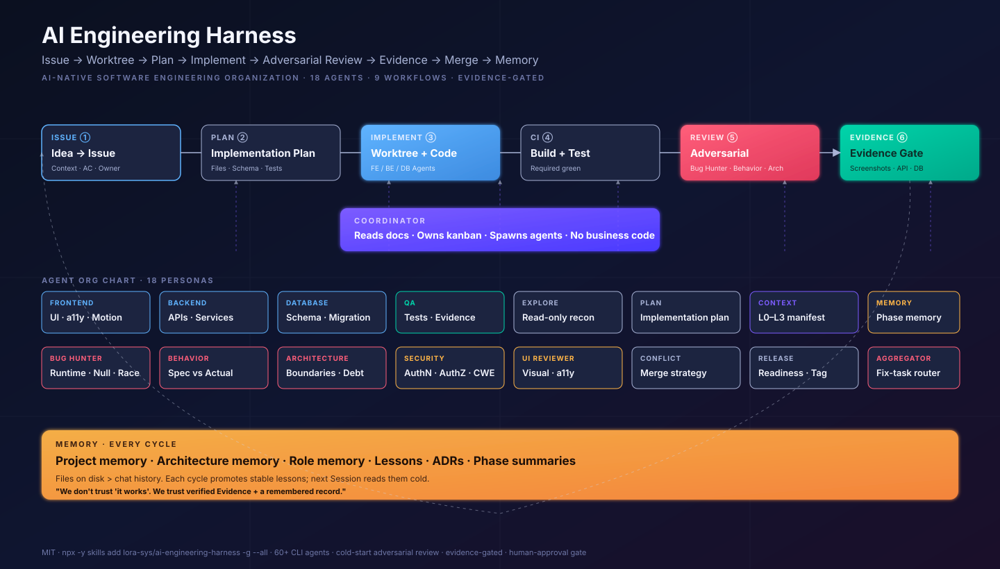
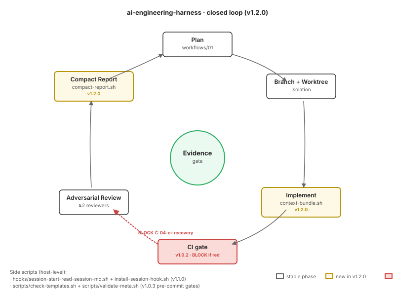

# AI Engineering Harness

> **Vibe 之后，正式接管。**
>
> 把失控的 Vibe Coding 作品，重新变成可验证、可维护的工程交付。
>
> 一个由 AI Agent 组成的软件工程组织，负责把你 AI 写完后不敢碰的仓库，变成可验证、可审查、可追溯的工程交付。
>
> A software-engineering organization of AI agents that turns vibe-coded repos into verifiable, reviewable, shippable code.

<p align="left">
  <a href="#一行安装全局生效到所有-cli-agent"></a>
  <a href="./LICENSE"></a>
  <a href="https://github.com/lora-sys/ai-engineering-harness"></a>
</p>



## 项目定位 · Positioning

### 你是不是也有这样的仓库？

AI 写了 2000 行代码，能跑，但没人敢改。没有测试，没有 CI，没有文档。你知道里面有问题，但不知道从哪开始。

**这就是 Harness 解决的问题。**

`ai-engineering-harness` 不是一条 Prompt，而是一套**软件工程组织操作系统**。你给它一个失控的仓库，它代你组建一个由 18 类 Agent 组成的工程团队，走完整闭环：

```
Idea → PRD → Issue → Agent 认领 → Worktree → 实施计划
     → 实现 → 自测 → Draft PR → CI → 对抗式审查 → 修 → 再审
     → 证据闸门 → 人工审批 → 合并 → 阶段总结 → 记忆沉淀 → 下一轮
```

代码只有在 **CI Pass + 至少 2 名冷启动审查员 Approved + 证据完整** 时才进入 `main`。没有"看起来跑通了"这种状态——只有**"可验证地跑通了"**。

## 核心 · What's inside

### 3 种能力 + 1 个观测面板

这个仓库是一个 **skill 家族**，可以单独装，也可以一起装：

| Skill | 能力 | 一句话 |
|-------|------|--------|
| **`$ai-engineering-harness`** | 工程接管与闭环交付 | 从 Issue 到 Merge 的全流程工程组织 |
| **`$build-agent-app`** | Agent App 设计与合约 | 设计 AI Agent 应用，交给 harness 实现 |
| **`$frontend-creative`** | Awwwards 级创意前端生成 | 用 AI 生成获奖级别的 Web UI |
| **`$dashboard`** | _可选 · 观测面板_ | Quick Scan 与看板，scaffold 进项目后自动拉起 |

前三个是你主动调用来产出工作的**交付**能力；`dashboard` 不同 —— 它被 scaffold 进
项目（`.dashboard/` + `localhost:4321`），只在项目里存在 `.dashboard/` 后才激活。

> AI 写得再快，也需要工程纪律。

### 闭环怎么运作

#### Issue 必须齐全以下字段

Context / Goal / Scope / Non-Goal / Related Docs / Implementation Plan / Acceptance Criteria / Evidence Requirements / Reviewer Requirements / Owner / Estimate。Coordinator 不会在缺失字段的 Issue 上启动代码。

#### 上下文按 L0–L3 分层加载

- **L0 全局规则**（`AGENTS.md`、`ENGINEERING.md`、`CONTRIBUTING.md` 摘要）— 始终加载
- **L1 任务级**——当前 Issue、模块架构、相邻 ADR、验证标准
- **L2 按需**——相邻模块、最近阶段总结、接口契约
- **L3 深层**——只有在显式需要时才加载；PDF/图片/长报告必须先抽取结论

`agents/context-assembly.md` 会为每个 Agent 任务产出 `context-manifest.md`，审查员能审计"这个 Agent 看到了什么"。

#### 证据闸门

Done 不是"PR 合进去了"，而是 `docs/evidence/<id>/` 里齐了：

- `change-summary.md` + `verification.md`（每条 AC 的 PASS/FAIL）
- 前端：`screenshots/`（桌面/平板/手机/空/错/加载六态）+ Playwright trace + Console 干净 + a11y 扫描
- 后端：API trace、异常覆盖、鉴权负面用例、性能基线
- 数据库：migration + rollback、Pre/Post stats、Sample rows
- 审查：`review-<role>.md` × ≥ 2 + `fix-tasks.md` Aggregator ✅
- CI：绿；无 Critical/High 阻断

#### 人工审批闸门

涉及 鉴权/授权模型 / 数据库 schema（含数据迁移） / 生产密钥或付费 API / 发布版本 时，Coordinator 会主动 `request_user_input` 或停在 PROJECT_STATUS 上等待 `Waiting for Approval`。

#### 文件系统消息总线

每个 Session 在 `sessions/<id>/` 下维护 `status.md`、`plan.md`、`execution.md`、`review.md`、`summary.md`。Agent 之间不靠聊天历史，只靠这些文件 + 各 Issue 的 Evidence 目录。新 Session 启动时 Coordinator 读取 `memory/` + 上一次 `summary.md` 恢复未完成工作。
### 仓库结构

| 目录 | 数量 | 是什么 |
|------|-----:|--------|
| [`agents/`](./agents/) | 18 <!-- count:agents --> | Agent 角色定义 |
| [`workflows/`](./workflows/) | 10 <!-- count:workflows --> | 闭环工作流（含 `09-pr-intake.md`） |
| [`templates/`](./templates/) | 16 <!-- count:templates --> | Issue / Plan / PR / Review / Evidence / Phase / ADR |
| [`checklists/`](./checklists/) | 6 <!-- count:checklists --> | 验收清单 |
| [`references/`](./references/) | 11 <!-- count:references --> | 深化文档（L0–L3、索引、Worktree、Agent spawn 等） |
| [`examples/`](./examples/) | 7 <!-- count:examples --> | 已填写示例 |
| [`skills/`](./skills/) | 3 <!-- count:skills --> | 兄弟 skill（`build-agent-app` / `frontend-creative` / `dashboard`） |
| [`tests/`](./tests/) | — | bats 回归测试 |
| [`hooks/`](./hooks/) | — | Claude Code SessionStart hook |
| [`scripts/`](./scripts/) | — | 维护脚本，见 [CONTRIBUTING.md](./CONTRIBUTING.md) |

入口是 [`SKILL.md`]（./SKILL.md）（Agent 加载的第一份文件）与
[`install.sh`]（./install.sh）（支持 40 个 CLI Agent target）。

## 安装 · Installation

### 一行安装（全局生效到所有 CLI Agent）

```bash
npx -y skills add lora-sys/ai-engineering-harness -g --all --full-depth
```

- `-g`：全局安装（写入用户级 skill 目录）
- `--all`：安装到所有受支持的 CLI Agent
- `--full-depth`：发现并安装所有 skill（包括 `build-agent-app`、`frontend-creative`、`dashboard`）

> ⚠️ **`--all` 装什么**：会把 `ai-engineering-harness` + `build-agent-app` + `frontend-creative` + `dashboard` 4 个 skill 一次性装到全部 40 个 CLI Agent。想只装一个，见下方「精确安装」。
> `dashboard` 只在项目里存在 `.dashboard/` 之后才激活，装上本身不会改动任何项目。

### 精确安装

```bash
# 装之前先看看里面有什么
npx -y skills add lora-sys/ai-engineering-harness --list

# 只装这一个 skill
npx -y skills add lora-sys/ai-engineering-harness -g -s ai-engineering-harness

# 只装到指定 agent
npx -y skills add lora-sys/ai-engineering-harness -g -a claude-code codex grok
```

兼容 40 个 CLI Agent：Claude Code、Codex、Grok、Cursor、Gemini、Qwen、Cline、Hermes-Agent、Continue、Devin、Roo、Tabnine、Trae、Warp、Windsurf、Zed 等。完整列表见 [`install.sh`]（./install.sh）。

### 手动安装（若你想要更多控制）

```bash
# 克隆
git clone https://github.com/lora-sys/ai-engineering-harness.git
cd ai-engineering-harness

# 安装到所有 Agent（交互式选择目标）
./install.sh

# 安装到指定 Agent
./install.sh --target claude

# 一次性铺到所有可写目录
./install.sh --all
```

`install.sh` 支持 40 个 target，详见下方兼容性表格。

### 一次性装齐整个家族（推荐）

`install.sh` 只装你点名的 skill。要一次装齐 3 个兄弟：

```bash
# 精简装（只 SKILL.md + meta.json）
bash scripts/install-all-skills.sh

# 完整装（workflows/ + references/ + templates/ 也复制）
bash scripts/install-all-skills.sh --fat

# 14 个目标全检查
bash scripts/install-all-skills.sh --status
```

把 `ai-engineering-harness` + `build-agent-app` + `frontend-creative` 装到全部 14 个 agent 平台（Codex / Claude / Cursor / Gemini / Qwen / OpenCode / Grok / Hermes / AiderDesk / Augment / Trae 等），让 Codex 能 `@build-agent-app` 和 `@frontend-creative`（不只是 `@ai-engineering-harness`）。

### 兼容的 CLI Agent

`install.sh` 支持 40 个 target，覆盖 Claude Code、Codex、Cursor、Gemini、Qwen、
Grok、OpenCode、Continue、Roo、Tabnine、Trae、Zed 等。完整列表与各自的安装路径
见下表，或直接读 [`install.sh`]（./install.sh）。

<details>
<summary><b>40 个 target 与安装路径（点开）</b></summary>

| Compatibility / 兼容性 | Install path / 安装路径 | Status after one-liner / 一行安装后状态 |
| --- | --- | --- |
| Claude Code | `~/.claude/skills/` | ✅ |
| Codex | `~/.codex/skills/` | ✅ |
| Cursor | `~/.cursor/skills/` | ✅ |
| Gemini CLI | `~/.gemini/skills/` | ✅ |
| Qwen / Qoder | `~/.qwen/skills/` | ✅ |
| Grok CLI | `~/.grok/skills/` | ✅ |
| OpenCode | `~/.config/opencode/skills/` | ✅ |
| Hermes-Agent | `~/.hermes/hermes-agent/skills/` | ✅ |
| Hermes | `~/.hermes/skills/` | ✅ |
| Aider Desk | `~/.aider-desk/skills/` | ✅ |
| Augment | `~/.augment/skills/` | ✅ |
| Bob | `~/.bob/skills/` | ✅ |
| Codebuddy | `~/.codebuddy/skills/` | ✅ |
| Commandcode | `~/.commandcode/skills/` | ✅ |
| Continue | `~/.continue/skills/` | ✅ |
| Crush | `~/.config/crush/skills/` | ✅ |
| Devin | `~/.config/devin/skills/` | ✅ |
| Factory | `~/.factory/skills/` | ✅ |
| Forge | `~/.forge/skills/` | ✅ |
| Goose | `~/.config/goose/skills/` | ✅ |
| iFlow | `~/.iflow/skills/` | ✅ |
| Junie | `~/.junie/skills/` | ✅ |
| KiloCode | `~/.kilocode/skills/` | ✅ |
| Kiro | `~/.kiro/skills/` | ✅ |
| Kode | `~/.kode/skills/` | ✅ |
| Marscode | `~/.marscode/skills/` | ✅ |
| Mux | `~/.mux/skills/` | ✅ |
| Neovate | `~/.neovate/skills/` | ✅ |
| OpenHands | `~/.openhands/skills/` | ✅ |
| Pi | `~/.pi/agent/skills/` | ✅ |
| Pochi | `~/.pochi/skills/` | ✅ |
| Roo | `~/.roo/skills/` | ✅ |
| Snowflake Cortex | `~/.snowflake/cortex/skills/` | ✅ |
| Tabnine | `~/.tabnine/skills/` | ✅ |
| Trae | `~/.trae/skills/` | ✅ |
| Trae-CN | `~/.trae-cn/skills/` | ✅ |
| Vibe | `~/.vibe/skills/` | ✅ |
| Zencoder | `~/.zencoder/skills/` | ✅ |
| Adal | `~/.adal/skills/` | ✅ |
| `.agents/` (unified) | `~/.agents/skills/` | ⏳ pending OS-level mount-RW on this system |

</details>

### 管理已有项目 · Managing existing projects

Harness 在不断演进 — v1.0 加了闭环，v1.4 加了 `sync-project.sh`,v1.7 加了 GHA + 4 套主题，v1.8 加了 `--auto` + `register-existing.sh`。**已经被这个 skill 接管的项目需要重跑 sync 才能拿到新功能。**

三条路径，全部幂等，全部非破坏性：

```bash
# 1. 更新 harness 自身
npx -y skills update lora-sys/ai-engineering-harness -g

# 2. 更新单个已接管的项目
bash /path/to/ai-engineering-harness/scripts/sync-project.sh --project-dir ~/projects/my-app --auto

# 3. 一次性更新所有项目
bash /path/to/ai-engineering-harness/scripts/register-existing.sh ~/repos
```

**设计上非破坏性** — 迁移从不覆盖用户内容：
- `compact-report.json` 永不覆盖（只在缺失时创建）
- AGENTS.md 的 fenced block（用 `<!-- HARNESS:START name -->` 标记）有边界 — harness 只管 block，其它都归用户
- `.github/ISSUE_TEMPLATE/` 只在缺失时复制
- `.harness-state.json` 重跑只改 `last_synced_at` 时间戳

## 用户画像 · Who is this for

- **你刚让 AI 写了一个项目**，能跑，但不敢改——不知道哪里埋了雷。
- **你接手了一个老项目**，没有测试、没有 CI、没有文档，不知道从哪开始整理。
- **你和团队用 AI 写代码**，但每次合并前都怕——不知道合进去的是什么。
- **你想让 AI 帮你做一个产品**，而不只是一段代码——需要从 PRD 到部署的完整流程。

## 解决什么问题 · What problems it solves

| 痛点 | Harness 怎么解决 |
|------|-----------------|
| AI 写的代码能跑但不敢改 | 自动跑 Quick Scan 发现 vibe 残留，生成可追踪的 Issue |
| 没有测试，改了怕炸 | 每个 Issue 强制产 Evidence（测试 + 截图 + API trace） |
| CI 红了不知道谁炸的 | 阻塞式 CI Gate，红了就停在 recovery 流程，直到修好 |
| 多人 / 多 Agent 改同一份代码 | Worktree 隔离 + Conflict Resolver |
| 合入前不知道改了什么 | 冷启动对抗式审查（Bug Hunter + Behavior Reviewer） |
| 知识丢在聊天历史里 | 每个 Phase 沉淀到 `memory/` + `docs/`，新 Agent 读这些再开工 |

## 使用案例 · Use cases

### 4 个最高频指令 · Top 4 invocations

#### ① 从 PRD 启动新项目 · Bootstrap a new project from a PRD

```
Use $ai-engineering-harness to bootstrap this repo from PRD.md.
```

Coordinator 会按 `workflows/00-project-bootstrap.md` 一次创建 `docs/{product,architecture,design,decisions}`、`memory/`、`PROJECT_STATUS.md`、`AGENTS.md` / `CLAUDE.md`、`DESIGN.md`、`ENGINEERING.md`、`TESTING.md`、`CONTRIBUTING.md`、`.github/ISSUE_TEMPLATE/`、`.github/PULL_REQUEST_TEMPLATE.md`、Phase 总结模板与首批 Issue。

The Coordinator runs `workflows/00-project-bootstrap.md`, creating the full doc tree, memory, status, project meta-docs, GitHub Issue / PR templates, and the first round of Issues.

#### ② 接续已存在的工作 · Resume interrupted work

```
Use $ai-engineering-harness. Read PROJECT_STATUS.md and continue the next Todo.
```

它会读 `memory/` + 上一次 Session 的 `summary.md`，从中断处继续。

Reads `memory/` + the last Session's `summary.md` and picks up where you left off.

#### ③ 把单个 Issue 推到合并 · Take one Issue to merged

```
Use $ai-engineering-harness to take Issue #17 from Planning to Done.
```

走完整闭环：写 Plan → 在 Worktree 里分派 Frontend/Backend/Database Agent → 实现 → 自测 → Draft PR → CI → 冷启动对抗式审查（Bug Hunter + Behavior Reviewer + 必要时 Architecture/Security/UI Reviewer）→ 修循环 → Evidence Gate → 合入 → 阶段总结 → 记忆沉淀。

Walks the full closed loop: Plan → spawn Frontend/Backend/Database on isolated Worktrees → Implement → Self-test → Draft PR → CI → cold-start adversarial review (Bug Hunter + Behavior Reviewer, plus Architecture/Security/UI when warranted) → Fix loop → Evidence Gate → Merge → Phase summary → Memory write.

#### ④ 复盘 / 救火 · Audit or rescue

```
Use $ai-engineering-harness to audit this repo: list open PRs older than 7 days,
flag missing Evidence, and produce a recovery plan.
```

它盘点"现状 → 期望"的 Gap，转成一批自动归列的 Issue，并给出先做的 3 件事与执行顺序。

The Coordinator inventories the gap from "current" to "expected", files a batch of Issues on the kanban, and surfaces the first three actions with sequencing.

### Quick Scan → 可追踪的 Issue

Quick Scan 跑 10 个 vibe-signs 检测器（硬编码密钥、缺失错误处理、重复逻辑、
风格漂移、缺少测试、意图丢失……），并且**主动喊出来**发现了什么，而不是只给你一个分数。
findings 不会停在终端里——一条命令分类归档成 Issue：

```bash
bash skills/dashboard/scripts/scan-to-issues.sh                  # 干跑：只打印草稿，不落库
bash skills/dashboard/scripts/scan-to-issues.sh --create         # 真的建 Issue（按类别各一条）
```

干跑是默认行为：建 Issue 会写进共享 tracker，所以要显式 `--create`。
细节见 `skills/dashboard/workflows/03-quick-scan.md`。

### 使用心法 · Operating principles

| # | 原则 · Principle | 为什么 · Why |
|---|---|---|
| 1 | **信任证据，不信任"看起来好了" · Trust evidence, not vibes** | Coordinator 不会因为"本地测试过了"就合并。它要看到 `docs/evidence/<id>/` 里所有 `verification.md` 的 AC 行 PASS，且 CI 绿、≥ 2 名审查员 ✅、Aggregator ✅。Missing one → not Done. |
| 2 | **冷启动审查 · Cold-start reviews** | Reviewer 只读 Issue + Plan + PR diff + Evidence,**不读实现者的聊天或解释**。这避免了"自己说服自己"。 |
| 3 | **Issue 是工作单元 · Issues are the unit of work** | 没有 Issue 不开工。Issue 必须有 Context / Goal / Scope / Non-Goal / Related Docs / Plan / AC / Evidence Reqs / Reviewer Reqs / Owner / Estimate。 |
| 4 | **Worktree 隔离 · Worktree isolation** | 一个 Issue = 一个 Owner = 一个 Worktree = 一个分支。多个并行 Owner 互不干扰，只在冲突时进 Conflict Resolver。 |
| 5 | **上下文按 L0–L3 加载 · L0–L3 context control** | 默认不加载 `docs/` 全文。让 `agents/context-assembly.md` 按任务产出 `context-manifest.md`，只给 Agent 当前必需的最小可信上下文。 |
| 6 | **人工审批闸门 · Human Approval Gate** | 涉及 鉴权 / 数据库 schema / 生产密钥 / 付费 API / 发布版本 时，Coordinator 会主动 `request_user_input` 并暂停。它不会代你做这些判断。 |
| 7 | **记忆是项目状态，不是聊天 · Memory is project state, not chat** | 稳定结论写到 `docs/` 与 `memory/`；对话历史不留。每个 Phase 结束后 Coordinator 跑 `workflows/06-phase-summary.md` 沉淀。 |
| 8 | **CI/CD 是阻塞闸门，不是检查项 · CI/CD is a blocking gate** | Owner 自首个 commit 起盯 CI;Coordinator 阻止进入 Phase 8 / 合并 / Done，直到 CI 绿。Red CI ⇒ `workflows/04-ci-recovery.md`，同一类失败 ≥2 次 ⇒ `ci`-tagged Issue + `memory/lessons.md` 一行。详见 `references/cd-monitoring.md`。 |
| 9 | **本地优先 · Local-first** | PR 提议的代码本地已有等价实现时，**不要直接合并**：留评论指路本地路径，让作者对齐本地版本或提议真正增量的东西。本地版本不动。对应 `workflows/09-pr-intake.md` Step 2。 |


### 典型指令清单 · Canonical invocations

```text
# 启动
Use $ai-engineering-harness to bootstrap this repo from PRD.md.

# 接续
Use $ai-engineering-harness. Read PROJECT_STATUS.md and continue the next Todo.

# 单 Issue 推动
Use $ai-engineering-harness to take Issue #17 from Planning to Done.

# 复盘 / 救火
Use $ai-engineering-harness to audit this repo and produce a recovery plan.

# 跨 CLI 接力(从 Claude 切到 Grok,聊天历史没用,落盘状态才行)
Use $ai-engineering-harness. I'm continuing from another agent. Read
memory/project-memory.md and sessions/<last-id>/summary.md, then continue.

# 只取一个 Phase 总结,而不打开所有 docs/
Use $ai-engineering-harness. Summarize the latest phase.

# 把多个 Issue 并行分派给前端 / 后端 / 数据库 Agent
Use $ai-engineering-harness to spawn parallel Owners for Issue #20, #21, #22.
```

### 进阶用法 · Advanced usage

#### 30 秒拉起一个新项目

```bash
mkdir my-saas && cd my-saas
git init
echo "# My SaaS" > README.md
git add . && git commit -m "feat: init"

# 进入任意 CLI(Codex / Claude / Grok / Cursor / Gemini ...)
# Use $ai-engineering-harness to bootstrap this repo from PRD.md
```

Coordinator 会生成目录骨架、首轮 Issue、ADR 模板、CI 工作流占位，然后在 `PROJECT_STATUS.md` 上写 "Phase 0 / Bootstrap — Done"。

#### 接手老项目，补齐工程基础设施

```
Use $ai-engineering-harness to take over this repo. Inventory the gap
between current state and harness layout; file Issues for the missing
pieces; do not edit code yet.
```

它先盘点 → 把差距落 Issue，再按 Issue 推进；**不会先去动业务代码**。

#### 跨 CLI 接力

Harness 的所有状态都落盘，**聊天历史不会丢**。从 Claude 切到 Grok 时：

```
Use $ai-engineering-harness. I'm continuing from another agent. Read
memory/project-memory.md and the latest sessions/<id>/summary.md.
```

#### 让 Agent 并行做多件事

```
Use $ai-engineering-harness to plan and dispatch Issue #18 (frontend),
#19 (backend), #20 (database) in parallel Worktrees.
```

Coordinator 会分别拉 `feature/18-...`、`feature/19-...`、`feature/20-...` 三个 Worktree，每个 Owner 独立推到 PR。冲突时由 Conflict Resolver 处理，**不会自动覆盖**。

#### 在 CI 出错时让它自愈

```
CI is red on PR #N. Use $ai-engineering-harness to recover.
```

走 `workflows/04-ci-recovery.md`:60 秒分类（flaky / 真缺陷 / lint / 集成 / infra）→ 派 Owner Agent 修复 → 重新跑 CI → 重新走 Reviewer。

### 不要这样用 · Anti-patterns

| 反模式 · Anti-pattern | 为什么不行 · Why it fails | 应该做 · Do this instead |
|---|---|---|
| 缺字段的 Issue 上让它"先做着" | Coordinator 不会启动。 | 补齐字段（模板就在 `.github/ISSUE_TEMPLATE/`）。 |
| 直接改 `main` / `master` | 拒绝。Worktree 是硬要求。 | `git worktree add ../proj-issue-<id> -b feature/<id>-<slug> main` |
| 让实现者同时"自审" | 审查员**必须冷启动**。 | 让它 spawn 一个独立 Reviewer Agent，只喂 Issue + Diff + Evidence。 |
| 把 100 页 PDF 当成整个 Spec 直接喂 | 上下文会被垃圾塞满。 | 用 `agents/context-assembly.md` 抽出相关章节再喂。 |
| "我觉得可以合并" | 不会合并。要 Evidence Gate 全绿 + Aggregator ✅。 | 等 Coordinator 自己报 Ready。 |
| 在它做事的中间打断催 | 打断 = 状态不一致。 | 看 PROJECT_STATUS.md / TaskList，不要直接抢方向盘。 |
| 把它当一次性 coding prompt | 它不是 Prompt，是 Harness。 | 用它管产品，不是写一行代码。 |

### 适用 / 不适用 速查 · When (not) to use

| 场景 · Scenario | 用 Harness? · Use it? |
|---|:---:|
| 把一个 PRD 落地成 MVP | ✅ 必须 · Mandatory |
| 多 Issue 并行开发 | ✅ 必须 · Mandatory |
| 接手老项目、清理技术债 | ✅ 强烈推荐 · Strongly recommended |
| 复盘一个失序的 repo | ✅ 强烈推荐 · Strongly recommended |
| 跨团队 / 跨 CLI 协作 | ✅ 推荐 · Recommended |
| 改一行 typo / 文案 / 配置 | ❌ 不要 · Skip |
| 一次性脚本 / 一次性原型 | ❌ 不要 · Skip |
| 只是想聊架构想法 / 解释概念 | ❌ 不要 · Skip |

## 效果展示 · Showcase

> 从「看起来能跑」到「可验证地跑通」。

这一节是**真实 e2e 跑出来的产物**（`feature/15-install-status`，commit `4f311e2`，merge `f5b26d1`），不是为 README 编出来的。

### 闭环图



黄色高亮的是 v1.2.0 新增。红色 CI 闸门是 harness 最强的 gate —— 比对抗式审查还强，因为 red CI 是唯一机械可观察的失败。

### context bundle 真样

`scripts/context-bundle.sh` 一次产出 18 KB / 281 行 markdown，子代理读它就不用各自 `git log / ls / find`。并行 ~5.6s，串行 ~8.0s。

### compact report 真样

`scripts/compact-report.sh` 产出 374 字节 JSON,Coordinator 读这个比读 20 KB 实现叙事快两个数量级。Test 状态从 `test-results/*` 自动扫，任何 FAIL 标记胜出。

### 自审里说了哪些实话

- `--status` 第一版有 bug：在空环境跑会把 `settings.json` 创建出来。是 7 个手动测试抓到的，删了文件创建那行才修好。
- Adversarial review 我只做了一行自问自答。真生产里得 spawn `bug-hunter` + `behavior-reviewer`。
- 没有真的开 GitHub Issue #15 —— 在自己仓库上很容易跳过这一步。

完整自审：[docs/evidence/15/self-review.md]（./docs/evidence/15/self-review.md）。

### 案例库 · Case Studies

真实接管前后对比：[docs/case-studies/README.md](./docs/case-studies/README.md)

| 案例 | Before → After | 关键数字 |
|------|---------------|----------|
| 内部工具项目（0 测试 → 47 测试） | Chaos 35 → 87 | F → B |
| install-session-hook（Harness 自审） | 0 → 完整证据包 | 281 行 bundle + 374 字节 report |
| Dashboard 一键接管 | 30 秒发现 23 个问题 | Chaos 42 → 目标 80+ |

## 快速上手 · Quickstart

5 步跑通第一个闭环。完整教程（9 节，含逐 Phase 拆解与可复制的 prompt 模板）见
**[QUICKSTART.md](./QUICKSTART.md)**。

1. **装上** — `npx -y skills add lora-sys/ai-engineering-harness -g --all --full-depth`
2. **接管** — 在你的仓库里说 `Use $ai-engineering-harness to take over this repo`
3. **看清楚** — Quick Scan 报出类别 + 最差位置；`bash skills/dashboard/scripts/scan-to-issues.sh` 干跑看草稿，`--create` 才真的落库
4. **推一个 Issue 到 merged** — `Use $ai-engineering-harness to take Issue #N from Planning to Done`
5. **收尾** — 证据落在 `docs/evidence/<id>/`，结论落在 `memory/`；下一个 Session 的 Agent 读这些开工

想深入哪一段，直接跳 QUICKSTART.md 对应的一节：

| 想知道 | 去哪一节 |
|--------|----------|
| 这个 skill 该不该用在我的场景 | 1 · When to use this skill |
| 9 条运行原则 | 2 · The 9 operating principles |
| 10 个工作流怎么挑 | 3 · Pick the right workflow |
| 从 bootstrap 到接外部 PR 的完整走一遍 | 4 · End-to-end example |
| 已接管的项目怎么升级 | 5 · Managing existing projects |
| 可复制的 prompt 模板 | 7 · Prompt templates |
| 该做 / 不该做 | 8 · Cheat sheet |

## 疑问解答 · FAQ

**这和直接让 AI 写代码有什么区别？**
AI 写代码是 `model`，这是 `harness`。区别在进 `main` 的条件不是"我觉得可以"，
而是 CI 绿 + ≥ 2 名冷启动审查员 Approved + 证据齐全。三者缺一就不是 Done。

**必须用 GitHub 吗？**
不必须。Issue / PR 是工作单元的载体，`scan-to-issues.sh --create` 用 `gh`，
但没有 `gh` 时干跑仍然可用；证据与状态全部落盘（`docs/evidence/`、`memory/`、
`sessions/`），不依赖任何 SaaS。

**会不会改我的东西？**
迁移是非破坏性的：`compact-report.json` 只在缺失时创建；`AGENTS.md` 只动
`<!-- HARNESS:START -->` 围栏内的内容，围栏外全归你；模板只在缺失时复制；
重跑 `sync-project.sh` 只更新 `last_synced_at`。

**只想要其中一个能力，能不装全家吗？**
可以：`npx -y skills add lora-sys/ai-engineering-harness -g -s <skill>`，
或 `bash install.sh --skill <name>`。

**装完只看到 `SKILL.md`？**
那是 `npx skills` 的 thin canonical 设计。用 `./install.sh --fat-install` 拿到完整
bundle；成因详见 [README_EN.md 的 Troubleshooting](./README_EN.md#troubleshooting--安装常见问题)。

**版本号为什么是 0.2.x，而 CHANGELOG 里有 1.x？**
现行版本是 [`VERSION`](./VERSION) 与 `meta.json` 里的 **0.2.2**。1.x 是早期一段历史
的编号，CHANGELOG 保留原样不改写。**以 0.2.x 为准**。

## 路线图 · Roadmap

三段：**Active**（本周在做的）、**Backlog**（计划中）、**Done**（已发布）。

### Active

_（Roadmap Part 1 和 Part 2 已完成 — 见 Done 段。）_

### Backlog

- frontend-creative: 4 套主题变体（Cyberpunk / Minimal Gallery / Retro Acid / Future 3D）
- frontend-creative: iteration-log 模板（防"AI 越改越普通"）
- frontend-creative: Awwwards 风格自评清单
- 主 harness: 给 `scripts/release-prep.sh` 加 `gh release` 自动化
- 主 harness: GHA workflow 跑 `scripts/run-tests.sh`（目前只有本地）

### Done

- **v1.7.0** — GHA workflow (`test.yml` runs harness tests on every PR) + `scripts/release.sh` (one-command release flow) + 4 frontend-creative theme variants + Awwwards / anti-drift gates wired into workflows; 69 bats tests
- **v1.6.0** — `skills/frontend-creative/` sibling skill (Awwwards-grade creative web UIs) + 2 `install.sh` bug fixes; 66 bats tests
- **v1.5.0** — PR intake flow (`workflows/09-pr-intake.md`) + Local-first principle (SKILL.md #9) + decision matrix; closes Roadmap Part 1
- **v1.4.0** — `scripts/sync-project.sh` + 58 个 bats 测试
- **v1.3.0** — bats 测试套件（38→58）+ 修 3 个 install-session-hook 回归
- **v1.2.1** — `install-session-hook.sh --status` + README Showcase 真实 e2e 产物
- **v1.2.0** — `context-bundle.sh` + `compact-report.sh`
- **v1.1.0** — `.claude/SESSION.md` 的 SessionStart hook（只读）
- **v1.0.x** — CI 作为阻塞闸门、validators、check-templates、install-session-hook、D-013 发版流程修复

## 维护与参与 · Maintenance

```bash
# 升级到最新版本
npx -y skills update lora-sys/ai-engineering-harness -g

# 查看当前装的版本
npx skills list -g

# 在项目仓库里加 git commit hook,自动维护 docs/ 的索引
cat > .githooks/post-commit <<'HOOK'
#!/usr/bin/env bash
bash <(curl -fsSL https://raw.githubusercontent.com/lora-sys/ai-engineering-harness/main/scripts/refresh-index.sh)
HOOK
chmod +x .githooks/post-commit
git config core.hooksPath .githooks
```

每个 Phase 完成后，Coordinator 会自动跑 `workflows/06-phase-summary.md` + `workflows/08-memory-evolution.md`，把"什么是真的学到的"沉淀进 `memory/<role>-memory.md`。下次有新 Session 启动，新 Agent 会先读这些再开工。

After each Phase, the Coordinator automatically runs `workflows/06-phase-summary.md` and `workflows/08-memory-evolution.md`, promoting stable lessons into `memory/<role>-memory.md`. Next Session, new Agents read these before starting work.

## 进阶阅读 · Further reading

- [`SKILL.md`](./SKILL.md) — Agent 加载的入口全文 · Entry document loaded by every agent
- [`agents/`](./agents/) — 18 类 Agent 角色 · 18 agent personas
- [`workflows/`](./workflows/) — 10 个工作流 · 10 closed-loop workflows
- [`templates/`](./templates/) — 16 套模板 · 16 templates (Issue / Plan / PR / Review / Evidence / Phase / ADR / ...)
- [`checklists/`](./checklists/) — 6 份验收清单 · 6 acceptance checklists
- [`examples/`](./examples/) — 7 份已填写示例 · 7 filled samples

## 许可 · License

MIT — 见 [LICENSE]（./LICENSE）。

> 让每一行代码，都有证据。
